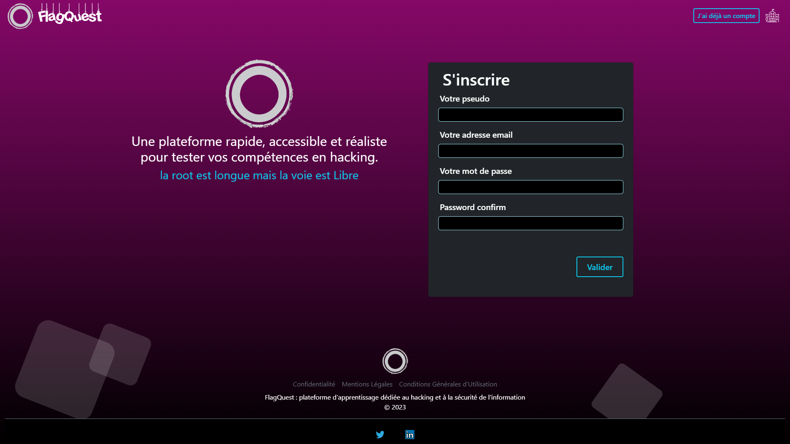
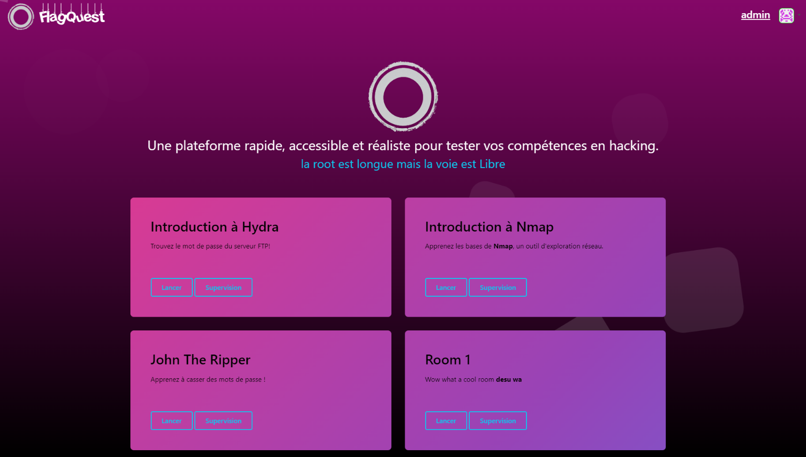
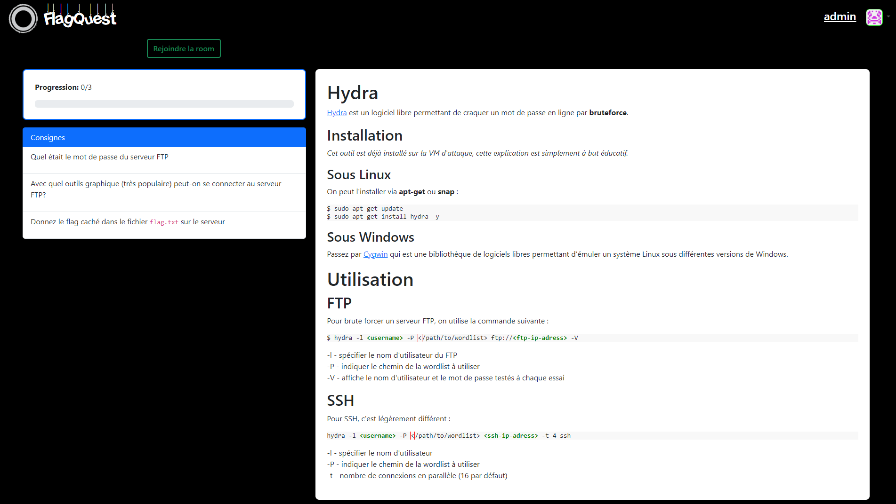
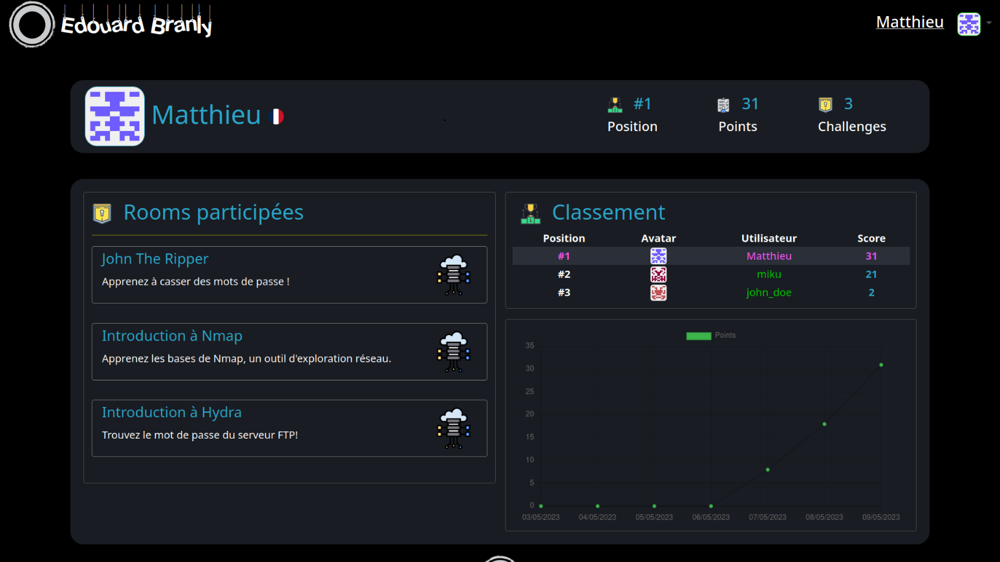

# FlagQuest

## Objectif

Ce projet a pour but d'apporter une solution conviviale et ludique pour l'apprentissage de la cybersécurité.  
Pour ce faire, un environnement de CTF est proposé, avec une intégration de tous les outils nécessaires via des machines virtuelles.

Pour les administrateurs, il est possible de facilement créer de nouveaux défis (appelés "rooms") ainsi que de les modifier directement depuis le site.

## Quelques screenshots (qui ne sont pas tout a fait a jour)

**Accueil**
  

**Room**

**Profil**

## Diagrammes
Des diagrames sont disponibles dans le dossier `./images/diagrams`

## Rapport
Le rapport associé à ce projet est disponible dans le fichier `./rapport.pdf`  
Adrien BRUAS n'ayant pas voulu que sa partie soit rendu publique, elle à été retiré, d'où l'absence des pages 53 à 67

## License
Ce projet utilise la license MIT